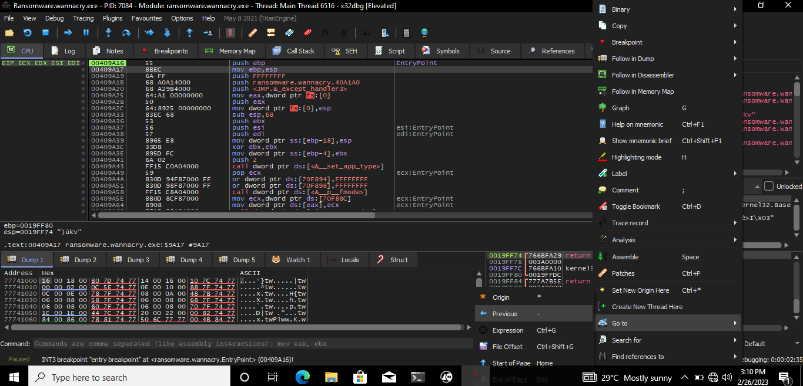

# WANNACRY-REPORT-TCMSEC-2023

## Summary:

## OS Used:
- Remnux
- FlareVM

### Basic Static Analysis:
 - Floss
 - PEView 
 - PEstudio
 
### Basic Dynamic Analysis
- Wireshark
- TCP View
- Procmon

### Advance Static Analysis:
- Cutter

### Advance Dynamic Analysis:
- x32dbg

 

 
